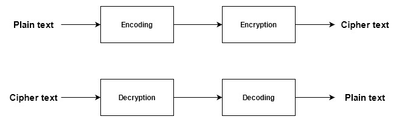

# ElGamal Encryption
    Prahar Ijner

ElGamal is a public key encryption system based on the discrete logarithm problem. It mainly uses 3 components: 
 - `p` : a large prime number, part of the public key
 - `e1` : a primitive root of the group <Zp*, x>, this is a part of the public key
 - `d` : an integer in the group <Zp*, x>, this is the private key
 - `e2` : a calculated number using (e1^d) mod p, this is a part of the public key

This project uses the ElGamal algorithm to encrypt a series of encoded text using the publicly known parameters `p`, `e1` and `e2`. One of the potential attacks on ElGamal based encryption is when `p` is small, an algorithm can be used to calculate the value of `d` by using efficient discrete log algorithms or brute force.

In this project, we use `p = 31847`, which is relatively small. Due to the small value of `p`, we use a brute force attack to calculate the value of `d` and compromise the encryption system. The calculation of `d` is implemented in the class constructor in `ElGamal/ElGamal.cpp`.

To speed up the process of encryption, decryption and calculation of `d`, we use the fast-exponentiation algorithm with the time complexity O(b), where b is the number of bits in the exponent.

The encryption-decryption process implemented in this project follows the following pipeline

## Encoding and decoding
The encoding process is defined by the function `encode()` in  `ElGamal/ElGamal.cpp`. The characters A-Z are assigned a value 0-25 (in order) and a 3 letter word is encoded using the following pattern:

*encoded value = character1 * 26^2 + character2 * 26^1 + character 3 * 26^1*

The encoding only occurs for words with 3 characters.

The decoding process is the inverse of encoding where the 3 characters are extracted from the *encoded value*. This is defined by `decode()` in `ElGamal/ElGamal.cpp`.

## Calculation of d
To calculate the private key `d`, we use a loop to from 1 to p-1 and chack if any of the values between the given range satisfies the equation e2 = (e1^x) mod p. We find the first such number that satisfies this equation and use it as our value of `d`. If `p` is large, this would obviously take too long to calculate. 

## Decryption
ElGamal encryption produces two cipher texts (`c1` and `c2`) for each encoded element. To decrypt the cipher texts, we use `(c2 * (c1^d)) mod p`.
The decryption algorithm can be found in `ElGamal/ElGamal.cpp`.