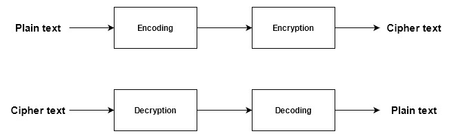

# RSA Encryption
    Prahar Ijner

RSA is a public key encryption system which mainly uses 3 components: 
 - `e` : the public key
 - `d` : the private key
 - `n` : a very large number created during the key generation process for modulus operations

This project uses the RSA algorithm to encrypt a series of encoded text using the publicly known parameters `e` and `n`. One of the potential attacks on RSA based encryption is when `n` is small, it can be factorized to retrieve the parameters used to generate it, and thus calculate `d`, the decryption key.

In this project, we use `n = 31313`, which is relatively small and can easily be factorized to calculate `d` and compromise the encryption system. The calculation of `d` is implemented in the class constructor in `RSA/RSA.cpp`.

To speed up the process of encryption and decryption, we use the fast-exponentiation algorithm with the time complexity O(b), where b is the number of bits in the exponent.

The encryption-decryption process implemented in this project follows the following pipeline

## Encoding and decoding
The encoding process is defined by the function `encode()` in  `RSA/RSA.cpp`. The characters A-Z are assigned a value 0-25 (in order) and a 3 letter word is encoded using the following pattern:

*encoded value = character1 * 26^2 + character2 * 26^1 + character 3 * 26^1*

The encoding only occurs for words with 3 characters.

The decoding process is the inverse of encoding where the 3 characters are extracted from the *encoded value*. This is defined by `decode()` in `RSA/RSA.cpp`.

## Calculation of d
To calculate the private key `d`, we use the factorization mathod to obtain the two prime numbers used to generate `n`. It should be noted that `n` is a product of two large prime numbers `p` and `q`. So, if these are calculated, we can find `phi(n)` which is a product of `p-1` and `q-1`. Finally, `d` is calculated by obtaining the inverse of `e` in `mod(phi(n))`.

## Encryption and decryption
A plain-text encoding `P` is encrypted by calculating `P^e mod(n)`.
A cipher-text `C` is decrypted by calculating `C^d mod(n)`. 